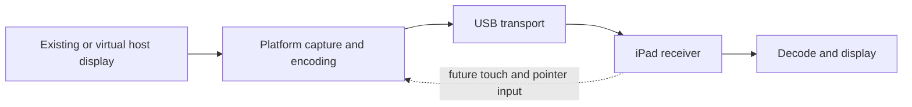

# USB iPad second display investigation

Date: 2026-09-12. Scope: both jailbroken iPads; USB; extend and mirror; crisp text
with balanced desktop performance; Linux first, Mac and Windows apps later.

## Native app milestone

The investigation progressed to a working native companion during this session.
Its UIKit interface uses AVSampleBufferDisplayLayer for fullscreen compressed
H.264 playback. A direct VideoToolbox callback-decoder experiment returned
OSStatus -12780 at frame submission; the system's compressed display layer
accepted the stream and the owner confirmed smooth visible motion. The exact
manual-decoder failure remains unexplained, and that unused path was removed.

The synthetic 720p run submitted 458 frames in about 15 seconds without renderer
errors. A full 2224×1668 extended-desktop run submitted 881 frames in 30 seconds
and transferred 17,768,004 H.264 payload bytes, again with no reported errors.
The host used `wf-recorder`, DMA-BUF capture and VA-API H.264 encoding through
`/dev/dri/renderD128`. Acknowledgments count frames enqueued, not independently
observed panel updates. Visual confirmation and counters are separate evidence.

The native protocol directly connects to an authenticated loopback receiver
through usbmux. SSH is used for setup, installation, launch and diagnostics.
The app is installed under mobile's Applications directory on the rootless
jailbreak. Seven automated transport/framing tests pass. See [protocol.md](protocol.md)
and the README for the working commands. A Linux GUI remains future work.

After removing the manual decoder, a 20-second mirror test at 2880×1800 with
60 fps requested submitted 654 frames (about 32 fps), with zero receiver drops
or rendering errors. This does not establish 60 fps support. The default remains
30 fps; sustained latency, heat, power and colored-text quality remain unmeasured.

## Initial baseline observations

### Follow-up: live scale changes

A user changing scale in Omarchy caused wf-recorder to exhaust its frame-copy
retries and exit. The launcher previously treated encoder EOF as fatal. Capture
now watches monitor geometry and restarts on layout changes, EOF or a stalled
encoder while keeping the output and authenticated USB connection alive.
Unexpected repeated failures are bounded; restarting never reapplies the initial
scale. In a 45-second live test, scale 2→1 and then resolution 2224×1668→1920×1440
with scale 2 triggered two successful recoveries: 1,270 frames queued, zero
receiver errors. Automated cases cover layout changes, EOF, stalls, retry limits
and child-process cleanup.

The large overlay was also replaced with a 44-point display button at the
bottom-left safe-area edge. Statistics open only from that button. Hide controls
persists the hidden state; a two-finger tap restores access. Ordinary video taps
no longer toggle the overlay, and a disconnected session does not force it open.

- Connected device: iPad Pro 10.5-inch (`iPad7,3`), iPadOS 17.7.10, rootless
  jailbreak layout at `/var/jb`, OpenSSH 9.7p1. Exact jailbreak brand not identified.
- Existing host public key installed for `mobile`; a fresh batch-mode login
  succeeded. Existing device authorized keys were preserved.
- Host: Arch Linux / Omarchy, Hyprland 0.56.2, internal screen 2880×1800 at scale 2.
- Hyprland successfully created an independent 2224×1668 output at scale 2,
  positioned to the right, and removed it at session end.
- Safari fetched content through a reverse SSH forward over the USB device
  connection and reported successful PNG decoding at 2224×1668.
- The first completed 25.06-second run sent 16 frames / 74,449,653 PNG bytes.
  Its last browser report acknowledged 15 frames at 23.096 seconds. Last-frame
  fetch/decode times in the final reports were about 1.4 seconds. These are
  application timings, not measured glass-to-glass latency.
- Safari reported `VideoDecoder` present and a secure context for the forwarded
  loopback URL. H.264 codec configuration and actual decoding remain untested.
- Both iPads are jailbroken according to the owner. The iPad 9 is not connected;
  its OS version, SSH setup, runtime capabilities and display path are unverified.

Full runtime details stay in ignored `.runtime/` files. No device identifier,
password, SSH key contents, screenshots, or personal app content belongs in Git.

## Device profiles

| Device | Landscape pixels | Proposed desktop scale | Logical desktop |
| --- | --- | --- | --- |
| iPad Pro 10.5-inch | 2224×1668 | 2 | 1112×834 |
| iPad 9th generation | 2160×1620 | 2 | 1080×810 |

Pixel dimensions come from Apple's [iPad Pro specifications](https://support.apple.com/en-us/111927)
and [iPad 9 specifications](https://support.apple.com/en-us/111898). Scaling is
our design choice. The first Safari viewport was 1112×731 in landscape, so
browser controls currently prevent a full-panel 1:1 presentation.

## Architecture

Keep device discovery, protocol, profiles, session state, and user-facing
connect/mirror/extend controls shared where useful. Each host platform needs its
own display creation, capture, encoder and input adapters. The future native
iPad receiver should work with all three host apps.

### USB transport

`usbmuxd` connects a host to listening sockets on an iOS device and has a
cross-platform ecosystem. This is distinct from personal-hotspot networking.
See the [upstream description](https://github.com/libimobiledevice/usbmuxd).

The working prototype uses `host HTTP server ← SSH reverse forward ← iPad Safari`.
SSH itself connects to port 22 through usbmux, with device selection restricted
to USB. Both forwarding endpoints bind to 127.0.0.1.

The first bulk-transfer attempts using `inetcat` disconnected. Replacing it with
a small Python relay that handles complete writes allowed the 25-second run to
finish. This isolates a useful workaround; it does not prove the exact original
failure mechanism. [Upstream inetcat source](https://github.com/libimobiledevice/libusbmuxd/blob/master/tools/inetcat.c)
was reviewed when investigating the relay.

The native receiver now accepts framed H.264 over its dedicated loopback TCP
listener reached through usbmux, authenticated with a token provisioned over
SSH. SSH remains the development and installation channel. Linux/macOS usbmux
sockets and Windows device service/driver integration need their own packaging
and broader reconnection tests.

### Linux app

Mirroring captures the chosen existing output. Extension creates a headless
output inside the same desktop session. Hyprland documents virtual outputs for
remote-display servers in its [hyprctl reference](https://wiki.hypr.land/0.54.0/Configuring/Using-hyprctl/).
The actual installed 0.56.2 Lua monitor API was used and its result read back.

The initial capture launched `grim` per frame, delivering lossless RGB PNG.
The working native sender now uses [wf-recorder](https://github.com/ammen99/wf-recorder)
for continuous compositor capture and verified VA-API H.264 encoding on this host.
Its software fallback uses libx264. Keep one frame in flight; renderer congestion
flushes the queue and waits for a keyframe. Broader GPU and compositor support
still needs validation.

[WayVNC](https://github.com/any1/wayvnc) and
[Deskreen](https://github.com/pavlobu/deskreen) are useful comparison baselines.
They do not eliminate platform-specific virtual display work. A browser WebRTC
prototype would additionally need to solve USB media transport: forwarding HTTP
signalling through SSH does not automatically carry WebRTC media.

### Mac app

Use [ScreenCaptureKit](https://developer.apple.com/documentation/screencapturekit/capturing-screen-content-in-macos)
for capture and investigate VideoToolbox for hardware H.264. Mirroring can start
with an existing display after screen-recording permission is granted.

Extension requires a separate virtual-display implementation. Projects such as
[SimpleDisplay](https://github.com/SamuelRioTz/SimpleDisplay) use undocumented
`CGVirtualDisplay` interfaces and explicitly note their compatibility risk.
Keep that backend isolated, test on the actual target Macs, and decide the
supported macOS versions and distribution route before making it a dependency.
ScreenCaptureKit alone does not provide our extended desktop.

### Windows app

Microsoft's [Indirect Display Driver model](https://learn.microsoft.com/en-us/windows-hardware/drivers/display/indirect-display-driver-model-overview)
explicitly covers remote and USB displays. Use an IddCx/UMDF adapter for extended
desktop and investigate Windows Graphics Capture for mirroring. Encode through
a supported hardware video path. Driver signing, installation, graphics device
loss, sleep/wake and reconnect are substantial Windows-specific work.

## Quality strategy

Native pixel dimensions and deliberate UI scaling come first. H.264 hardware
decoding is the first video candidate; prove an actual configuration on both
iPads before choosing profiles or promising 60 fps. Low-delay encoding, bounded
buffering, and avoiding unnecessary resizes matter as much as bitrate.

Common H.264 4:2:0 chroma subsampling may soften colored text even at high bitrate.
Compare terminal/editor test patterns against the PNG baseline. Consider a
lossless refresh of static regions after motion if video alone is insufficient.
Do not assume both iPads support hardware 4:4:4 decoding.

Start performance experiments at native resolution / 30 fps, then evaluate
60 fps, host CPU/GPU load, iPad temperature, charging balance, and actual latency.
These are targets, not current capabilities. Capture/decode frame counters do
not replace a camera-based end-to-end latency measurement.

## Next milestones

1. Measure text quality, actual latency, power and thermal behavior of the working
   native stream. Test disconnects, backgrounding and long sessions more broadly.
2. Add device capability negotiation, orientation options and better connection
   feedback to the native receiver. Validate the actual iPad 9.
3. Linux host UI with device choice, mirror/extend, resolution/scale, connect,
   disconnect, and automatic output cleanup. Add input only after display is solid.
4. Validate the iPad 9 on USB; add safe device switching and then optional
   simultaneous displays if desired.
5. Implement the Mac and Windows host adapters and apps against the same receiver.
   Target Mac hardware/macOS and Windows versions remain to be specified.

The local Git repository is ready for a private GitHub remote after review.
